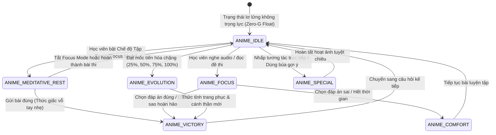

# ĐẶC TẢ THIẾT KẾ HOẠT ẢNH LINH THÚ ANIME HỘ MỆNH (ELEGANT ANIME GUARDIAN SPIRITS) — TOEIC PRO v10.0.0

> **Tiêu chuẩn Thẩm mỹ:** Anime Thần Thoại Thanh Lịch (Genshin Impact / Kyoto Animation / Makoto Shinkai Aesthetic) · GSAP 3.x Animation Rigging · 4 Cấp Độ Tiến Hóa Linh Khí · Biểu Cảm Cảm Xúc Đa Tầng (Expression Sheet) · Particle VFX Engine · Đồng Bộ Âm Thanh & Xúc Giác.  
> **Đồng bộ Nghiệp vụ:** Mục 11.0 & Section B/D của `SRS-TOEIC-PRO-v10.0.0-Screen-Design-Flows.md`.  
> **Phiên bản:** v10.0.0-ANIME-MASTER.

---

## MỤC LỤC HỆ THỐNG ANIME GUARDIAN SPIRITS

- [1. TỔNG QUAN TÁI THIẾT KẾ PHONG CÁCH ANIME THANH LỊCH](#1-tổng-quan-tái-thiết-kế-phong-cách-anime-thanh-lịch)
  - [1.1 Triết Lý Thẩm Mỹ Thần Thức Hộ Mệnh (Celestial Anime Guardians)](#11-triết-lý-thẩm-mỹ-thần-thức-hộ-mệnh-celestial-anime-guardians)
  - [1.2 Bảng Phân Vai Nhân Vật & Bảng Màu Nguyên Tố](#12-bảng-phân-vai-nhân-vật--bảng-màu-nguyên-tố)
  - [1.3 4 Cấp Độ Tiến Hóa Linh Thần (4 Stages of Ascension)](#13-4-cấp-độ-tiến-hóa-linh-thần-4-stages-of-ascension)
- [2. MÁY TRẠNG THÁI HOẠT ẢNH CỐT LÕI (FINITE STATE MACHINE)](#2-máy-trạng-thái-hoạt-ảnh-cốt-lõi-finite-state-machine)
- [3. HỒ SƠ THIẾT KẾ CHI TIẾT 5 THẦN THỨC ANIME](#3-hồ-sơ-thiết-kế-chi-tiết-5-thần-thức-anime)
  - [3.1 SPARKY — THIẾU NIÊN SẤM SÉT (LIGHTNING GUARDIAN)](#31-sparky--thiếu-niên-sấm-sét-lightning-guardian)
  - [3.2 ECHLET — THÁNH NỮ SÓNG ÂM (SONIC MAIDEN)](#32-echlet--thánh-nữ-sóng-âm-sonic-maiden)
  - [3.3 LUMINK — THIẾU NỮ TINH TÚ (STARLIGHT SCHOLAR)](#33-lumink--thiếu-nữ-tinh-tú-starlight-scholar)
  - [3.4 STREAKLYN — HOÀNG TỬ HỎA LONG (FLAME DRAGON PRINCE)](#34-streaklyn--hoàng-tử-hỏa-long-flame-dragon-prince)
  - [3.5 VERBIL — HIỀN TRIẾT CỔ TỰ (JADE RUNE SAGE)](#35-verbil--hiền-triết-cổ-tự-jade-rune-sage)
- [4. BỘ BIỂU CẢM CẢM XÚC ĐA DẠNG (EXPRESSION SHEET)](#4-bộ-biểu-cảm-cảm-xúc-đa-dạng-expression-sheet)
- [5. HỆ THỐNG HIỆU ỨNG HẠT NGUYÊN TỐ (ELEMENTAL PARTICLE VFX ENGINE)](#5-hệ-thống-hiệu-ứng-hạt-nguyên-tố-elemental-particle-vfx-engine)
- [6. ĐỒNG BỘ ÂM THANH & PHẢN HỒI XÚC GIÁC (AUDIO-HAPTIC FEEDBACK)](#6-đồng-bộ-âm-thanh--phản-hồi-xúc-giác-audio-haptic-feedback)
- [7. QUY CHUẨN NEO TỌA ĐỘ VÀ BÓNG THOẠI TRÊN GIAO DIỆN FIGMA](#7-quy-chuẩn-neo-tọa-độ-và-bóng-thoại-trên-giao-diện-figma)

---

## 1. TỔNG QUAN TÁI THIẾT KẾ PHONG CÁCH ANIME THANH LỊCH

### 1.1 Triết Lý Thẩm Mỹ Thần Thức Hộ Mệnh (Celestial Anime Guardians)

Nhằm mang lại trải nghiệm thị giác cao cấp, lãng mạn và ngập tràn cảm hứng cho học viên luyện thi TOEIC, toàn bộ 5 linh thú được nâng tầm từ các linh vật hoạt họa sang **Hình tượng Thần Thức Anime Thanh Lịch (Elegant Anime Celestial Guardians)**:
- **Tỉ lệ nhân vật chuẩn Anime:** Đường nét gương mặt thanh tú, đôi mắt sáng lấp lánh như bầu trời sao, mái tóc bồng bềnh chuyển sắc gradient tinh tế.
- **Trang phục Cổ phong & Vũ trụ:** Kết hợp giữa trang phục gấm lụa thần thoại (Haori, áo dạ hội sao băng, vạt áo lụa chuyển màu) và các phụ kiện ma thuật hiện đại (kính lúp thiên văn, tai nghe dạ quang, đuốc hỏa tinh, ngọc bội cổ tự).
- **Tư thế Không trọng lực (Zero-G Levitation):** Nhân vật luôn lơ lửng bồng bềnh nhẹ nhàng giữa không gian, vạt áo và mái tóc tung bay theo gió vũ trụ.

---

### 1.2 Bảng Phân Vai Nhân Vật & Bảng Màu Nguyên Tố

| Nhân Vật Anime | Danh Hiệu Thần Thức | Kỹ Năng Chuyên Môn | Bảng Màu Trang Phục | Pháp Khí Đồng Hành | File Hình Ảnh Gốc |
|:---|:---|:---|:---|:---|:---|
| **⚡ Sparky** | Thiếu Niên Sấm Sét | Tốc độ Part 5 & Phản xạ `< 8s` | Vàng Sét `#F59E0B` · Lam Đêm `#1E1B4B` | Haori dệt tia sét, Bùa chú Lôi đình | `sparky_anime.webp` |
| **🦉 Echlet** | Thánh Nữ Sóng Âm | Thính giác Part 2, 3 & Bẫy đồng âm | Xanh Ngọc `#06B6D4` · Tím Hoàng Hôn `#6366F1` | Lông vũ sóng âm, Vòng quang phổ nốt nhạc | `echlet_anime.webp` |
| **🦊 Lumink** | Thiếu Nữ Tinh Tú | Đọc hiểu Part 7 & Định vị manh mối | Oải Hương `#A855F7` · Bạch Kim `#F8FAFC` | Kính lúp thiên văn khúc xạ cầu vồng | `lumink_anime.webp` |
| **🐉 Streaklyn** | Hoàng Tử Hỏa Long | Giữ lửa Streak & Ý chí học tập | Đỏ Chu Sa `#EF4444` · Hổ Phách `#EA580C` | Hỏa châu bồng bềnh, Sừng rồng dung nham | `streaklyn_anime.webp` |
| **🐢 Verbil** | Hiền Triết Cổ Tự | Từ vựng chuyên sâu & Thuật toán SM-2 | Lục Bảo `#10B981` · Ngọc Bích Cẩm Thạch | Thẻ ngọc La-tinh, Cuộn sách cổ thư | `verbil_anime.webp` |

---

### 1.3 4 Cấp Độ Tiến Hóa Linh Thần (4 Stages of Ascension) Đồng Bộ 4 Quần Xã Sinh Thái

Mỗi nhân vật trải qua 4 giai đoạn thăng hoa nhan sắc và trang phục tương ứng chặt chẽ với tiến trình học viên vượt ải qua 4 Quần Xã Sinh Thái (Biomes) trên Bản đồ Saga:

```text
[ STAGE 1: SOUL EMBRYO (SƠ TÂM) ] ──────────► [ STAGE 2: ADVENTURER (HÀNH GIẢ) ]
(0% - 25% Lộ Trình · QUẦN XÃ SUNRISE_VALLEY)    (26% - 50% Lộ Trình · QUẦN XÃ ECHO_FOREST)
• Ngoại hình thiếu niên ngây thơ, dịu dàng       • Khoác thêm áo choàng phiêu lưu gấm lụa
• Mái tóc bồng bềnh nhẹ, mắt sáng long lanh       • Trang bị pháp khí thính giác & quang học
• Hiệu ứng hạt hào quang mờ quanh thân           • Vẫy tay chào thanh lịch mỗi khi mở App

                     │                                               │
                     ▼                                               ▼

[ STAGE 3: FIERCE HERO (HIỆP SĨ) ] ──────────► [ STAGE 4: CELESTIAL DEITY (THẦN LINH) ]
(51% - 75% Lộ Trình · QUẦN XÃ GRAMMAR_CANYON)   (76% - 100% Lộ Trình · QUẦN XÃ APEX_SUMMIT)
• Trang phục chiến binh giáp nhẹ hoàng gia       • Hóa thân Thần Thức Tối Cao hoàn mỹ
• Hào quang nguyên tố cuộn trào quanh chân       • Đôi cánh năng lượng vũ trụ tỏa rộng
• Nhào lộn ăn mừng chiến thắng 3 sao rực rỡ       • Khắc tên vĩnh cửu trên Bảng Vàng Chứng Chỉ
```

---

### 1.4 Khóa Phạm Vi MVP — MVP Scope Lock (1 Stage × 5 Biểu Cảm × 5 Thần Thức = 25 Asset)

> **Nguyên tắc:** Chốt phạm vi sản xuất asset MVP tối thiểu khả dụng, bảo đảm 100% tiến độ bàn giao và tính nhất quán phong cách trước khi mở rộng.

#### 1.4.1 Phạm Vi MVP (v10.0 — v10.1)

| Hạng mục | Giá trị MVP |
|:---|:---|
| **Stage (Giai đoạn tiến hóa)** | **1 duy nhất** — Stage 1: Sơ Tâm (Soul Embryo) |
| **Biểu cảm khuôn mặt (Expressions)** | **5 trạng thái** — `idle`, `focus`, `victory`, `comfort`, `evolution` |
| **Số nhân vật (Guardians)** | **5** — Sparky, Echlet, Lumink, Streaklyn, Verbil |
| **Tổng số asset tĩnh** | **25 file WebP alpha** ($5 \times 5 = 25$) |
| **Trạng thái `special`** | Hoãn — chuyển sang Post-MVP (v10.2+) |

#### 1.4.2 Ma Trận Asset MVP (25 WebP Alpha Files)

| Nhân Vật | `idle` | `focus` | `victory` | `comfort` | `evolution` |
|:---|:---|:---|:---|:---|:---|
| **⚡ Sparky** | `sparky_idle.webp` | `sparky_focus.webp` | `sparky_victory.webp` | `sparky_comfort.webp` | `sparky_evolution.webp` |
| **🦉 Echlet** | `echlet_idle.webp` | `echlet_focus.webp` | `echlet_victory.webp` | `echlet_comfort.webp` | `echlet_evolution.webp` |
| **🦊 Lumink** | `lumink_idle.webp` | `lumink_focus.webp` | `lumink_victory.webp` | `lumink_comfort.webp` | `lumink_evolution.webp` |
| **🐉 Streaklyn** | `streaklyn_idle.webp` | `streaklyn_focus.webp` | `streaklyn_victory.webp` | `streaklyn_comfort.webp` | `streaklyn_evolution.webp` |
| **🐢 Verbil** | `verbil_idle.webp` | `verbil_focus.webp` | `verbil_victory.webp` | `verbil_comfort.webp` | `verbil_evolution.webp` |

> **Quy cách kỹ thuật mỗi asset:**
> - Định dạng: **WebP** (primary) + **PNG** (fallback) — **bắt buộc có kênh Alpha trong suốt**
> - Độ phân giải gốc: $1024 \times 1024\text{ px}$ (Retina 3x)
> - Dung lượng tối đa: WebP $\le 150\text{ KB}$, PNG $\le 300\text{ KB}$
> - Nền: **Trong suốt 100%** (alpha = 0) — tuyệt đối **KHÔNG dùng JPEG** (không hỗ trợ alpha)
> - Đường dẫn: `/public/lexlings/{character}_{expression}.webp`

#### 1.4.3 Lộ Trình Mở Rộng Stage (Post-MVP Milestones)

| Phiên Bản | Stage Mở Khóa | Tổng Asset Tích Lũy | Ghi Chú |
|:---|:---|:---|:---|
| **v10.0 — v10.1 (MVP)** | Stage 1: Sơ Tâm | 25 | Nền tảng cốt lõi |
| **v10.2** | Stage 2: Hành Giả | 50 | +25 asset, thêm `special` expression |
| **v10.3** | Stage 3: Hiệp Sĩ | 80 | +30 asset (6 expressions × 5) |
| **v11.0** | Stage 4: Thần Linh | 110 | +30 asset, hoàn chỉnh Evolution Sequence |

#### 1.4.4 Giải Pháp Tạm Thời MVP (Fallback Strategy)

Trong giai đoạn MVP khi chưa có đủ 25 asset riêng biệt cho mỗi biểu cảm:
- Sử dụng **1 asset chung** (`{character}_anime.webp`) cho tất cả 5 expressions
- CSS/GSAP transforms tạo hiệu ứng phân biệt trạng thái: `scale`, `saturate`, `brightness`, `opacity`
- Hàm `resolveGuardianImage()` trong `AnimeGuardian.tsx` đã sẵn sàng chuyển sang per-expression khi asset sản xuất xong

## 2. MÁY TRẠNG THÁI HOẠT ẢNH CỐT LÕI (FINITE STATE MACHINE)



### 2.1 Trạng Thái Thiền Định Tĩnh Lặng (ANIME_MEDITATIVE_REST) Trong Focus Mode
- **Mục tiêu nhận thức:** Khi học viên kích hoạt Focus Mode hoặc đang làm các câu hỏi nghe/đọc căng thẳng, linh thú tự động chuyển về tư thế thiền định:
  - Mini avatar thu gọn vào góc HUD (32px), mắt nhắm nhẹ, ngồi khoanh chân hoặc cuộn mình êm dịu.
  - Tắt 100% hoạt ảnh giật lắc, tắt các hạt particle phát sáng lơ lửng.
  - Vầng sáng thở êm (Gentle Breathing Glow): Chu kỳ `duration: 4.0s`, `opacity: 0.25 -> 0.4`, tuyệt đối không gây xao nhãng giác quan.

### 2.2 Quy Chuẩn Hiệu Năng & Trợ Năng Kỹ Thuật (Performance & A11y Guardrails)
- **Leaf Client Component Isolation:** Toàn bộ component hoạt ảnh linh thú phải được bao bọc trong `React.memo` tại tầng lá (Leaf Component) để ngăn chặn re-render dây chuyền khi State bài thi thay đổi.
- **Dự phòng Giảm chuyển động (`prefers-reduced-motion: reduce`):** Tự động chuyển 100% hoạt ảnh sang ảnh tĩnh phẳng chất lượng cao (WebP/SVG Poster), thời gian chuyển cảnh tức thì hoặc fade-in `0.15s`.
- **Low-Tier Adaptive Rendering (Android / Máy cấu hình thấp):** Tắt bộ lọc `backdrop-filter: blur()` và SVG displacement filters trên thiết bị cấp thấp (`--tier3-blur: none`), duy trì khung hình ổn định $\ge 60\text{ fps}$.

#### 2.2.1 Quy Chuẩn Định Dạng Asset Nhân Vật (Character Asset Format Specification)

| Thuộc Tính | Quy Định | Ghi Chú |
|:---|:---|:---|
| **Định dạng chính (Primary)** | **WebP** có kênh Alpha | Hỗ trợ 98%+ trình duyệt hiện đại |
| **Định dạng dự phòng (Fallback)** | **PNG-24** có kênh Alpha | Cho Safari 13- và trình duyệt cũ |
| **TUYỆT ĐỐI CẤM** | **JPEG** ❌ | Không hỗ trợ alpha → lỗi viền đen/trắng |
| **Độ phân giải gốc** | $1024 \times 1024\text{ px}$ | Retina 3x sắc nét trên mọi DPR |
| **Dung lượng tối đa** | WebP $\le 150\text{ KB}$, PNG $\le 300\text{ KB}$ | Tối ưu LCP & mạng 3G |
| **Color Profile** | sRGB IEC61966-2.1 | Nhất quán màu sắc cross-platform |
| **Nền** | Trong suốt 100% (`alpha = 0`) | Hòa trộn hoàn hảo với mọi backdrop |

**Mẫu HTML `<picture>` element với WebP primary + PNG fallback:**
```html
<picture>
  <source srcset="/lexlings/sparky_idle.webp" type="image/webp" />
  
</picture>
```

**Hàm tiện ích kiểm tra hỗ trợ WebP trong code:**
```typescript
// Sử dụng resolveGuardianImage() từ AnimeGuardian.tsx
// MVP fallback: {character}_anime.webp → dùng Next.js <Image> tự động tối ưu
import { resolveGuardianImage } from '@/components/AnimeGuardian';
const src = resolveGuardianImage('sparky', 'idle');
```

---

## 3. HỒ SƠ THIẾT KẾ CHI TIẾT 5 THẦN THỨC ANIME

---

### 3.1 SPARKY — THIẾU NIÊN SẤM SÉT (LIGHTNING GUARDIAN)

#### 1. Ngoại Hình & Thẩm Mỹ Anime
- **Tạo hình:** Thiếu niên Kitsune/Sóc sấm sét khôi ngô, nụ cười rạng rỡ đầy tự tin. Mái tóc vàng óng bồng bềnh với những lọn tóc phát ra ánh sáng tia chớp nhỏ.
- **Đôi tai & Chiếc đuôi:** Đôi tai sóc nhỏ nhọn vểnh cao lanh lợi, chiếc đuôi hoàng kim khổng lồ uốn lượn hình tia sét phát sáng rực rỡ như một vầng hào quang sau lưng.
- **Trang phục:** Áo Haori màu lam thẫm (Midnight Blue) thêu hoa văn chòm sao và những đường chỉ vàng phát quang tia sét, thắt lưng đai gấm thêu ngọc bích.
- **Pháp khí:** Những lá bùa lôi điện lơ lửng quanh đầu ngón tay.

#### 2. Kịch Bản Hoạt Ảnh GSAP

```javascript
export const AnimeSparkyMotion = {
  // Lơ lửng dịu dàng với mái tóc và vạt áo bồng bềnh
  idleFloating: (target) => {
    const tl = gsap.timeline({ repeat: -1 });
    tl.to(target, { y: -10, rotateZ: 1.5, duration: 2.2, ease: "sine.inOut", yoyo: true })
      .to(`${target} .lightning-tail`, { rotateZ: 5, duration: 1.4, ease: "sine.inOut", yoyo: true }, 0);
    return tl;
  },

  // Tuyệt chiêu Tia Sét Thần Tốc (<8s): Dư ảnh lướt nhanh
  thunderStrike: (target) => {
    return gsap.timeline()
      .to(target, { scale: 1.15, filter: "brightness(1.5)", duration: 0.15 })
      .to(target, { x: 50, duration: 0.1, ease: "power4.in" })
      .to(target, { x: 0, duration: 0.35, ease: "elastic.out(1.2, 0.4)" });
  }
};
```

---

### 3.2 ECHLET — THÁNH NỮ SÓNG ÂM (SONIC MAIDEN)

#### 1. Ngoại Hình & Thẩm Mỹ Anime
- **Tạo hình:** Nàng tiên chim cú siêu âm với vẻ đẹp thanh tao, thuần khiết và tĩnh lặng. Mái tóc dài màu bạc ánh tím khói bay lượn trong không gian vũ trụ.
- **Đôi tai & Đôi cánh:** Tai cài lông vũ cú mèo tinh tế phát ra sóng âm thanh màu xanh ngọc bích (`#06B6D4`), đôi cánh lụa mỏng manh nửa trong suốt buông rủ như váy dạ hội.
- **Trang phục:** Đầm dạ hội màu xanh lam chuyển sắc tím huyền ảo, cổ áo đính đá sapphire, quanh eo có vòng quang phổ nốt nhạc xoay tròn.
- **Pháp khí:** Cây đàn thụ cầm vô hình tạo ra những làn sóng âm tròn đồng tâm lan tỏa xoa dịu tâm trí học viên.

#### 2. Kịch Bản Hoạt Ảnh GSAP

```javascript
export const AnimeEchletMotion = {
  // Tập trung lắng nghe: Mắt khép hờ, vòng sóng âm lan tỏa
  focusHarmonics: (target) => {
    return gsap.timeline({ repeat: -1 })
      .to(`${target} .sonic-rings`, { scale: 2.2, opacity: 0, duration: 1.6, stagger: 0.4, ease: "power1.out" })
      .to(target, { y: -6, duration: 2.4, ease: "sine.inOut", yoyo: true }, 0);
  },

  // Phát hiện bẫy đồng âm: Mở to đôi mắt ngọc bích, sóng âm bừng sáng
  trapAlert: (target) => {
    return gsap.timeline()
      .to(`${target} .feather-ears`, { scale: 1.25, filter: "drop-shadow(0 0 15px #06B6D4)", duration: 0.2 })
      .to(target, { y: -15, duration: 0.3, ease: "back.out(2)" });
  }
};
```

---

### 3.3 LUMINK — THIẾU NỮ TINH TÚ (STARLIGHT SCHOLAR)

#### 1. Ngoại Hình & Thẩm Mỹ Anime
- **Tạo hình:** Thiếu nữ học giả tinh tú với nét đẹp thông minh, đôi mắt tím tử đinh hương trong veo. Mái tóc bạch kim ánh tím bồng bềnh dài chấm gót chân, đính những chiếc kẹp tóc hình ngôi sao lấp lánh.
- **Trang phục:** Váy dạ hội học giả thiên văn màu xanh đêm huyền bí kết hợp lụa trắng hoàng gia, viền thêu chỉ vàng hình các chòm sao trên bầu trời.
- **Pháp khí:** Chiếc **Kính Lúp Tinh Tú** bằng đồng cổ khảm ngọc, có khả năng khúc xạ ánh sáng thành cầu vồng rực rỡ soi rõ từng manh mối trong bài đọc dài Part 7.

#### 2. Kịch Bản Hoạt Ảnh GSAP

```javascript
export const AnimeLuminkMotion = {
  // Quét kính lúp tìm manh mối văn bản
  searchClues: (target) => {
    return gsap.timeline({ repeat: -1 })
      .to(`${target} .celestial-monocle`, { x: 15, y: -8, rotateZ: 12, duration: 1.8, ease: "sine.inOut", yoyo: true })
      .to(`${target} .starlight-dust`, { opacity: 0.9, duration: 0.9, yoyo: true, repeat: -1 }, 0);
  },

  // Ăn mừng tìm thấy đáp án: Cười rạng rỡ, giơ cao kính lúp phát sáng sao băng
  foundKey: (target) => {
    return gsap.timeline()
      .to(target, { y: -20, scale: 1.08, duration: 0.4, ease: "back.out(1.8)" })
      .to(`${target} .prism-rainbow`, { opacity: 1, scale: 1.5, duration: 0.6 });
  }
};
```

---

### 3.4 STREAKLYN — HOÀNG TỬ HỎA LONG (FLAME DRAGON PRINCE)

#### 1. Ngoại Hình & Thẩm Mỹ Anime
- **Tạo hình:** Vị hoàng tử rồng lửa khôi ngô tuấn tú, khí chất vương giả cao quý và ánh mắt ấm áp kiên định. Mái tóc đỏ rực pha ánh vàng cam như ngọn lửa thiêng.
- **Cặp sừng & Ngọn lửa:** Đôi sừng rồng bằng ngọc hổ phách trong suốt vươn cao kiêu hãnh. Trên lòng bàn tay luôn có một quả cầu lửa ấm áp bay lơ lửng, thỉnh thoảng tỏa ra tàn lửa hình trái tim.
- **Trang phục:** Long bào cổ phong màu đỏ chu sa thêu họa tiết rồng vàng uốn lượn tinh xảo, áo choàng vai bọc giáp vàng sang trọng.
- **Biểu tượng:** Vị thần hộ mệnh bảo vệ ý chí kiên định và chuỗi ngày học liên tục không gián đoạn.

#### 2. Kịch Bản Hoạt Ảnh GSAP

```javascript
export const AnimeStreaklynMotion = {
  // Nhịp thở ngọn lửa thần
  flameHeartbeat: (target) => {
    return gsap.timeline({ repeat: -1 })
      .to(`${target} .fire-orb`, { scale: 1.2, y: -8, filter: "drop-shadow(0 0 25px #EA580C)", duration: 1.0, yoyo: true, ease: "sine.inOut" })
      .to(target, { y: -8, duration: 2.0, yoyo: true, ease: "sine.inOut" }, 0);
  },

  // Thổi vòng khói trái tim ăn mừng chuỗi Streak bảo toàn
  celebrateStreak: (target) => {
    return gsap.timeline()
      .to(`${target} .fire-orb`, { scale: 1.4, duration: 0.3 })
      .fromTo(`${target} .heart-ember`, { scale: 0.2, opacity: 1, y: 0 }, { scale: 1.6, opacity: 0, y: -60, duration: 1.4, ease: "power2.out" });
  }
};
```

---

### 3.5 VERBIL — HIỀN TRIẾT CỔ TỰ (JADE RUNE SAGE)

#### 1. Ngoại Hình & Thẩm Mỹ Anime
- **Tạo hình:** Vị hiền triết học giả thanh tao, nho nhã với phong thái ung dung tự tại. Mái tóc xanh ngọc bích dài mượt mà cài trâm ngọc cổ phong, đôi mắt lục bảo điềm tĩnh thấu suốt tri thức.
- **Trang phục:** Đạo bào nho nhã bằng lụa ngọc bích viền vàng kim, thắt lưng mang hoa văn mai rùa lục giác cách điệu phong cách phong ấn tri thức cổ đại.
- **Pháp khí:** Những tấm thẻ ngọc cẩm thạch và các ký tự La-tinh, Hy Lạp cổ đại (`α, β, θ, Ω`) lơ lửng xoay tròn xung quanh, đại diện cho kho tàng 5000 từ vựng cốt lõi.

#### 2. Kịch Bản Hoạt Ảnh GSAP

```javascript
export const AnimeVerbilMotion = {
  // Phù chú cổ ngữ xoay vòng quanh thân
  runicOrbit: (target) => {
    return gsap.timeline({ repeat: -1 })
      .to(`${target} .jade-tablets`, { rotateZ: 360, duration: 20, ease: "none" })
      .to(`${target} .greek-runes`, { opacity: 0.9, duration: 1.5, yoyo: true, repeat: -1, ease: "sine.inOut" }, 0);
  },

  // Gật đầu khen ngợi khi học viên nhớ từ 5 sao
  wisdomApproval: (target) => {
    return gsap.timeline()
      .to(target, { y: 4, duration: 0.3, yoyo: true, repeat: 2, ease: "power1.inOut" })
      .to(`${target} .emerald-halo`, { scale: 1.3, opacity: 1, duration: 0.5, yoyo: true, repeat: 1 });
  }
};
```

---

## 4. BỘ BIỂU CẢM CẢM XÚC ĐA DẠNG (EXPRESSION SHEET)

Mỗi nhân vật Anime sở hữu 6 trạng thái gương mặt tinh tế tương ứng với từng giai đoạn học tập. **MVP khóa 5 biểu cảm đầu tiên** (xem Mục 1.4):

| # | Biểu Cảm | Tên Kỹ Thuật (`AnimationState`) | Kích Hoạt | MVP |
|:---|:---|:---|:---|:---|
| 1 | **😊 Happy & Warm** (Nghỉ ngơi / Mở App) | `idle` | Trạng thái mặc định | ✅ MVP |
| 2 | **🧐 Deep Focus** (Làm bài thi / Nghe audio) | `focus` | Học viên nghe audio / đọc đề thi | ✅ MVP |
| 3 | **🤩 Ecstatic Victory** (Đạt 3 sao / Thăng hạng) | `victory` | Chọn đáp án đúng / Đạt 3 sao | ✅ MVP |
| 4 | **🥺 Gentle Comfort** (Trả lời sai / Hụt Streak) | `comfort` | Chọn sai / Hết thời gian | ✅ MVP |
| 5 | **⚡ Awakened Ascension** (Tiến hóa cấp độ) | `evolution` | Đạt mốc tiến hóa 25/50/75/100% | ✅ MVP |
| 6 | **✨ Special Interaction** (Nhấp tương tác) | `special` | Nhấp trực tiếp / Dùng bùa gợi ý | ⏳ Post-MVP (v10.2+) |

**Mô tả chi tiết biểu cảm khuôn mặt:**
1. **😊 `idle` — Happy & Warm:** Nụ cười dịu dàng, ánh mắt trìu mến đón chào học viên.
2. **🧐 `focus` — Deep Focus:** Chân mày khẽ nhíu nhẹ tập trung cao độ, đôi mắt nhìn thẳng vào câu hỏi.
3. **🤩 `victory` — Ecstatic Victory:** Mắt bừng sáng rực rỡ, miệng cười tươi reo vui, hai má ửng hồng.
4. **🥺 `comfort` — Gentle Comfort:** Ánh mắt đồng cảm bao dung, đưa tay làm cử chỉ che chở và an ủi.
5. **⚡ `evolution` — Awakened Ascension:** Khí chất thần linh uy nghi, hào quang rực sáng toàn thân.
6. **✨ `special` — Special Interaction _(Post-MVP)_:** Tuyệt chiêu cá nhân hóa theo nguyên tố (Lôi Điện, Sóng Âm, Tinh Tú, Hỏa Tinh, Phù Văn).

**Quy ước đặt tên file asset biểu cảm:**
```
/public/lexlings/{character}_{expression}.webp
Ví dụ: sparky_idle.webp, echlet_focus.webp, lumink_victory.webp
```

---

### 5. HỆ THỐNG HIỆU ỨNG HẠT NGUYÊN TỐ (ELEMENTAL PARTICLE VFX ENGINE)

Hệ thống hạt được render bằng Canvas 2D / WebGL siêu nhẹ với chế độ hòa trộn `mix-blend-mode: screen` (additive blending) và tự động tắt khi pin yếu hoặc kích hoạt `prefers-reduced-motion`:

| Nhân Vật | Loại Hạt Hiển Thị | Quỹ Đạo Chuyển Động & Tốc Độ | Màu Sắc & Hòa Trộn (Blend Mode) | Cấu Hình Emitter Max Particles |
| :--- | :--- | :--- | :--- | :--- |
| **Sparky** | Tia chớp zic-zac & Tinh thể sấm vàng | Bắn tỏa 360 độ từ đuôi sét, tốc độ $v = 120\text{px/s}$ | Vàng hổ phách `#F59E0B`, Trắng (`screen`) | Max 35 hạt, vòng đời $0.6\text{s}$ |
| **Echlet** | Sóng âm tròn & Bụi lông vũ dạ quang | Lan tỏa sóng âm mở rộng ra ngoài, bán kính $R: 10 \to 80\text{px}$ | Xanh cyan `#06B6D4`, Tím iris (`screen`) | Max 20 vòng sóng, vòng đời $1.2\text{s}$ |
| **Lumink** | Sao băng lấp lánh & Bụi tinh vân | Xoay nhẹ theo hình xoắn ốc Fibonacci $r = a e^{b\theta}$ | Tím lavender `#A855F7`, Vàng kim (`screen`) | Max 45 hạt bụi sao, vòng đời $1.8\text{s}$ |
| **Streaklyn**| Tàn lửa bay lên & Khói hình trái tim | Trôi bồng bềnh thẳng lên trên trục Y, dao động X nhẹ | Đỏ chu sa `#EF4444`, Cam lửa (`screen`) | Max 30 hạt đốm lửa, vòng đời $1.0\text{s}$ |
| **Verbil** | Cổ tự Hy Lạp & Vòng sáng cẩm thạch | Bay lơ lửng quanh đạo bào, tự quay quanh trục $Z$ | Xanh lục bảo `#10B981`, Bạch ngọc (`screen`) | Max 15 phù tự, vòng đời $2.5\text{s}$ |

---

## 6. ĐỒNG BỘ ÂM THANH & PHẢN HỒI XÚC GIÁC (AUDIO-HAPTIC FEEDBACK)

- **Khi trả lời đúng (<8s với Sparky):** Rung nhịp đôi vui tươi (`[30ms, 40ms, 30ms]`), âm thanh tiếng chuông lôi đình thanh thoát tần số cao $1200\text{Hz}$.
- **Khi phát hiện bẫy (Echlet):** Rung nhẹ cảnh báo (`[60ms]`), âm thanh tiếng sóng âm ngân vang trong trẻo $440\text{Hz} \to 880\text{Hz}$.
- **Khi bảo toàn chuỗi lửa Streak (Streaklyn):** Rung tim đập bập bùng (`[80ms, 60ms, 80ms]`), tiếng bập bùng lửa ấm áp.
- **Khi tiến hóa thần thú (Ascension):** Rung hợp âm chiến thắng (`[100ms, 50ms, 100ms, 50ms, 200ms]`), hợp âm thánh ca vang dội 7 nốt.
- **Hạ tầng Audio Sprite & Preload Tức Thì (< 50ms Latency):**
  - Mọi hiệu ứng âm thanh (Fanfare 1-2-3 sao, click nút, đúng/sai, tiếng sấm, sóng âm, lửa rồng) được đóng gói thành một file **Audio Sprite duy nhất** (`audio_effects_sprite.mp3` / `.webm`) kèm sơ đồ timestamp (Cue Points JSON).
  - Tự động preload vào Web Audio API buffer ngay khi học viên khởi động ứng dụng, bảo đảm âm thanh phát ngay lập tức khi người dùng bấm đáp án (độ trễ $< 50\text{ ms}$), loại bỏ hoàn toàn độ trễ tải mạng làm mất "cảm giác đã tay" kiểu Candy Crush.
- **Tuân thủ Quyền riêng tư & Tiếp cận (Accessibility):** Có tùy chọn gạt tắt rung Haptics và hiệu ứng âm thanh trong màn hình [S-23] Cài Đặt Hệ Thống.

---

## 7. QUY CHUẨN NEO TỌA ĐỘ VÀ BÓNG THOẠI TRÊN 26+ MÀN HÌNH FIGMA

### 7.1 Kích Thước Khung Neo Chuẩn (Standard Anchor Frames)
- **🖥️ Desktop 1440px:** Frame `280 × 280 px`, ghim góc phải dưới màn hình (`Right: 48px, Bottom: 40px`, `z-index: 30`).
- **📱 Mobile 393px (iPhone 15 Pro):** 
  - *Chế độ Thường (Floating Buddy):* Frame `96 × 96 px`, ghim trên góc phải Bottom Bar (`Right: 16px, Bottom: 96px`).
  - *Chế độ Chibi Mini (During Exam CBT):* Thu nhỏ thành Avatar tròn `48 × 48 px` nằm trên Header ghim, không gây phân tâm.
  - *Chế độ Zen Exam Mode:* Tắt 100% avatar Thần Thức trong phòng thi dành cho học viên lo âu / ADHD.

### 7.2 Ma Trận Vị Trí Neo Chi Tiết Cho 26+ Màn Hình
1. **[S-01] Landing Page:** Hero 3D Stage trung tâm bên phải (`600x520px`, Streaklyn Stage 1).
2. **[S-02 / S-03] Đăng Ký / Đăng Nhập:** Chibi Sparky chào mừng ở góc phải Form Card (`72x72px`).
3. **[S-04] OTP Verification:** Sparky ôm đồng hồ cát kỹ thuật số lơ lửng trên bàn phím số (`120x120px`).
4. **[S-05] Onboarding Setup:** Sân khấu Carousel 3D toàn màn hình, hiển thị cả 5 Thần Thức kích thước `360x360px`.
5. **[S-24] Onboarding Micro-Win:** Thần Thức đồng hành xuất hiện cùng câu hỏi khởi động siêu nhanh đầu tiên (`240x240px`), bùng nổ hoạt ảnh Mini-Evolution khi người học giải đúng trong 60s.
6. **[S-06] Diagnostic Briefing:** Echlet & Lumink song hành chỉ dẫn quy chế test (`180x180px`).
7. **[S-07] CBT Listening Arena:** Echlet sóng âm ngự tại thanh Audio Player (`120x120px`), phát radar phát hiện bẫy. Thêm lời động viên sau mỗi 5 câu.
8. **[S-08] CBT Reading Arena:** Lumink cầm kính thiên văn soi sáng đoạn văn dài (`120x120px`).
9. **[S-09] Diagnostic Result:** Hoạt ảnh Thần Thức thức tỉnh Stage 2 bung tỏa cánh hào quang trung tâm (`400x400px`).
10. **[S-10] Central Dashboard:** Bento Card chính trung tâm (`260x260px`), tương tác vuốt ve đổi thoại.
11. **[S-11] Daily Task & Pomodoro:** Sparky đứng trên đỉnh đồng hồ cát đếm ngược Pomodoro (`160x160px`).
12. **[S-12 / S-13] ETS CBT Exam:** Chuyển sang HUD Mini Avatar `40x40px` góc phải trên; hoặc ẩn hoàn toàn nếu bật Zen Exam Mode.
13. **[S-14] Micro-Drill Focus:** Thần Thức chuyên môn xuất hiện tương ứng với Part đang luyện (`140x140px`).
14. **[S-15] Free Practice Hub:** 5 Thần Thức chia nhau đại diện cho 7 Part tại các Card lớn.
15. **[S-16] Score Certificate:** Thần Thức đứng tự hào cạnh Khung Chứng Chỉ Điểm ETS (`240x240px`).
16. **[S-17] Review & Karaoke:** Echlet dẫn nhịp dải sóng âm đồng bộ phụ đề song ngữ (`140x140px`).
17. **[S-18] SM-2 Mistake Notebook:** Verbil lật từng thẻ ngọc La-tinh phù chú (`180x180px`).
18. **[S-19] Competency Heatmap:** Lumink cầm kính viễn vọng chỉ vào các ô kỹ năng đỏ cần cải thiện (`160x160px`).
19. **[S-20] Weekly Colosseum:** Thần Thức khoác vương miện đứng cạnh Top 1 trên bục vinh quang (`200x200px`).
20. **[S-21] Gems In-Game Bazaar:** Streaklyn quản lý kho báu kim cương và ngọn lửa đổi vật phẩm (`180x180px`).
21. **[S-22] Astral Profile:** Hiển thị Thần Thức ở Cấp Độ Thức Tỉnh (Stage) hiện tại của học viên (`260x260px`).
22. **[S-23] Control Center:** Verbil làm người hướng dẫn tùy chỉnh cấu hình trợ năng (`140x140px`).
23. **[S-25 / S-26] Admin Portal:** Logo nhận diện hệ thống và linh vật hỗ trợ thống kê dữ liệu.
24. **[S-27] 2.5D Isometric Saga Map:** Thần Thức làm linh vật dẫn đường (Map Walker), bay lơ lửng trên trạm bài học hiện tại dọc theo 4 Quần Xã (`SUNRISE_VALLEY`, `ECHO_FOREST`, `GRAMMAR_CANYON`, `APEX_SUMMIT`) tương tác qua 5 loại nút trạm. Trạm đã vượt phát sáng hào quang kẹo ngọt ấm áp (`80x80px`).
25. **[S-28] Saga Node Exercise:** Thần Thức hỗ trợ gợi ý chiến thuật cho Part 6 Cloze Split-View và Part 2 Minimalist Audio Stage (`140x140px`). Khi học viên bật Chế độ Tập Trung (Focus Mode), Thần Thức chuyển sang tư thế "Thiền định tĩnh lặng" (Mini HUD 32px) để triệt tiêu mọi phân tâm.
26. **[S-29] Victory Stage & Evolution:** Pháo hoa hạt nguyên tố bung nở, Thần Thức ăn mừng 3 sao (`320x320px`).
27. **[S-30] Exit Milestone Exam:** Thần Thức hóa Thần Tối Cao Stage 4 tại đỉnh `APEX_SUMMIT`, sải rộng đôi cánh ánh sáng vũ trụ (`420x420px`).

### 7.3 Thiết Kế Bong Bóng Thoại Không Trọng Lực (Glassmorphism Speech Bubble)
- Cấu trúc Auto Layout: Padding `12px 18px`, Radius `18px`, Fill `rgba(15, 23, 42, 0.85)` kết hợp `backdrop-filter: blur(16px)`, Border `1px solid rgba(255,255,255,0.15)`.
- Mũi tên chỉ hướng: Gradient trong suốt hướng về miệng nhân vật.
- Tự động ẩn: Tự thu nhỏ thành bong bóng chấm tròn khi người dùng cuộn nhanh hoặc đang thao tác gõ phím.

### 7.4 Ngân Sách Chú Ý & Tự Ghim Tĩnh Khi Đọc Đề (Attention Budget & Focus Freeze)
- **Rủi ro phân tâm:** Trong các màn hình học tập thông thường (S-07/08, S-14, S-28), chuyển động lơ lửng liên tục của Thần Thức có thể thu hút mắt nhìn và làm giảm khả năng đọc hiểu câu hỏi TOEIC.
- **Quy tắc Focus Freeze (Tự Ghim Tĩnh):**
  - Khi học viên bắt đầu đọc đề (con trỏ chuột nằm trong vùng câu hỏi hoặc sau khi chạm vào lựa chọn): Thần Thức tự động thu hẹp biên độ dao động từ $\Delta y = 8\text{px} \to 2\text{px}$, tạm ngắt hiệu ứng hạt phát sáng quanh thân, và chuyển sang biểu cảm `ANIME_EXPRESSION_FOCUS` tĩnh lặng.
  - Khi học viên nộp bài / nhận kết quả: Hoạt ảnh hoạt náo và âm thanh bùng nổ trở lại tức thì. Nhờ đó, nhân vật luôn đáng yêu nhưng không bao giờ cướp quyền chú ý của nội dung học thuật.

---

## 8. LỘ TRÌNH RIG XƯƠNG VÉC-TƠ (VECTOR-SKELETAL RIG ROADMAP: LOTTIE → SPINE → RIVE)

> **Tầm nhìn:** Chuyển đổi từ asset raster tĩnh (WebP/PNG) sang hệ thống hoạt ảnh véc-tơ khung xương (skeletal rig) cho phép:
> - Giảm $>80\%$ dung lượng tải so với raster sprite sheets
> - Hoán đổi biểu cảm mượt mà (smooth state blending) runtime qua code
> - Scale vô hạn không vỡ pixel trên mọi DPR/thiết bị
> - Interactive branching animation (phản ứng theo hành vi người dùng real-time)

### 8.1 Tổng Quan 4 Giai Đoạn (Phased Migration)

```text
┌─────────────────────────────────────────────────────────────────────────────────┐
│  PHASE 1 (MVP · v10.0-10.1)          PHASE 2 (v10.2)                          │
│  ┌───────────────────────┐            ┌───────────────────────┐                │
│  │  Static WebP/PNG      │  ───────►  │  Lottie JSON          │                │
│  │  + CSS/GSAP Transforms│            │  (After Effects →     │                │
│  │  25 assets @ ≤150KB   │            │   Bodymovin Export)   │                │
│  └───────────────────────┘            └───────────────────────┘                │
│                                                │                               │
│                                                ▼                               │
│  PHASE 4 (v11.0)                      PHASE 3 (v10.3)                         │
│  ┌───────────────────────┐            ┌───────────────────────┐                │
│  │  Rive State Machine   │  ◄───────  │  Spine 2D Skeletal    │                │
│  │  (Interactive GPU     │            │  (Runtime Mesh Deform  │                │
│  │   Branching Runtime)  │            │   + Expression Blend)  │                │
│  └───────────────────────┘            └───────────────────────┘                │
└─────────────────────────────────────────────────────────────────────────────────┘
```

### 8.2 Chi Tiết Từng Giai Đoạn

#### Phase 1: Static WebP/PNG + CSS/GSAP (MVP · v10.0 — v10.1) ✅ HIỆN TẠI

| Hạng Mục | Chi Tiết |
|:---|:---|
| **Công nghệ** | WebP alpha + Next.js `<Image>` + GSAP 3.x transforms |
| **Asset** | 25 file WebP ($5 \times 5$), fallback `{character}_anime.webp` |
| **Ưu điểm** | Zero dependency, nhanh triển khai, tương thích 100% trình duyệt |
| **Hạn chế** | Không blend giữa expressions, cần raster riêng cho mỗi trạng thái |
| **Deliverable** | `resolveGuardianImage()` trong `AnimeGuardian.tsx` |

#### Phase 2: Lottie JSON Animation (v10.2)

| Hạng Mục | Chi Tiết |
|:---|:---|
| **Công nghệ** | Lottie Web (`lottie-react` hoặc `@lottiefiles/react-lottie-player`) |
| **Pipeline** | Adobe After Effects → Bodymovin plugin → `.lottie` / `.json` export |
| **Scope** | `idle` + `focus` loop animations cho 5 guardians (10 Lottie files) |
| **Ưu điểm** | Véc-tơ thuần túy ~20-50KB/animation, scale vô hạn, loop mượt |
| **Hạn chế** | Chỉ hỗ trợ timeline animation, không có runtime state blending |
| **Fallback** | `<picture>` WebP cho trình duyệt không hỗ trợ Canvas/SVG renderer |

```typescript
// Pseudo-code Phase 2 integration
import { useLottie } from 'lottie-react';

function GuardianLottie({ character, state }) {
  const animData = useMemo(() => import(`/animations/${character}_${state}.json`), [character, state]);
  const { View } = useLottie({ animationData: animData, loop: true });
  return <View />;
}
```

#### Phase 3: Spine 2D Skeletal Rig (v10.3)

| Hạng Mục | Chi Tiết |
|:---|:---|
| **Công nghệ** | Spine 2D Runtime (`spine-ts` / `spine-pixi`) + PixiJS v8 |
| **Pipeline** | Spine Editor → `.skel` + `.atlas` + texture `.webp` export |
| **Scope** | Full 5 expressions × 5 guardians với runtime mesh deformation |
| **Ưu điểm** | Blend giữa expressions real-time, IK (Inverse Kinematics), mesh warp |
| **Hạn chế** | Yêu cầu Spine license, WebGL canvas, tăng bundle ~60KB |
| **Deliverable** | `SpineGuardianRenderer` component thay thế `AnimeGuardian` |

#### Phase 4: Rive State Machine (v11.0 — Mục Tiêu Cuối Cùng)

| Hạng Mục | Chi Tiết |
|:---|:---|
| **Công nghệ** | Rive Runtime (`@rive-app/react-canvas`) với GPU-accelerated WASM renderer |
| **Pipeline** | Rive Editor → `.riv` export với State Machine tích hợp |
| **Scope** | Interactive branching: nhân vật phản ứng real-time theo input người dùng |
| **Ưu điểm** | State Machine graph trong editor, GPU render ~120fps, tiny file size ~15-30KB |
| **Hạn chế** | Cần redesign toàn bộ character trong Rive Editor |
| **Deliverable** | `RiveGuardianEngine` component với input bindings |

```typescript
// Pseudo-code Phase 4 integration
import { useRive, useStateMachineInput } from '@rive-app/react-canvas';

function GuardianRive({ character, state }) {
  const { rive, RiveComponent } = useRive({
    src: `/animations/${character}_rig.riv`,
    stateMachines: 'GuardianFSM',
    autoplay: true,
  });
  const expressionInput = useStateMachineInput(rive, 'GuardianFSM', 'expression');
  
  useEffect(() => {
    if (expressionInput) expressionInput.value = EXPRESSION_MAP[state];
  }, [state, expressionInput]);
  
  return <RiveComponent />;
}
```

### 8.3 Chiến Lược Di Chuyển (Migration Strategy)

1. **Progressive Enhancement:** Mỗi phase là lớp nâng cấp chồng lên phase trước, không phá vỡ tương thích ngược.
2. **Feature Detection:** Kiểm tra `WebGL2RenderingContext` và `OffscreenCanvas` trước khi tải Spine/Rive runtime.
3. **Fallback Chain:** `Rive → Spine → Lottie → Static WebP` — tự động xuống cấp trên thiết bị yếu.
4. **A/B Testing:** Đo lường FPS, LCP, và user engagement giữa raster vs vector trên từng tier thiết bị.

### 8.4 Ngân Sách Hiệu Năng Mục Tiêu (Performance Budget)

| Metric | Phase 1 (WebP) | Phase 2 (Lottie) | Phase 3 (Spine) | Phase 4 (Rive) |
|:---|:---|:---|:---|:---|
| **File Size / Guardian** | $\le 150\text{ KB}$ | $\le 50\text{ KB}$ | $\le 80\text{ KB}$ (+ atlas) | $\le 30\text{ KB}$ |
| **Runtime Memory** | ~2 MB (5 imgs) | ~5 MB (Canvas) | ~8 MB (WebGL) | ~4 MB (WASM) |
| **FPS Target** | 60 fps (CSS) | 60 fps (Canvas) | 60 fps (WebGL) | 120 fps (GPU) |
| **First Paint Impact** | $\le 200\text{ ms}$ | $\le 300\text{ ms}$ | $\le 400\text{ ms}$ | $\le 250\text{ ms}$ |
