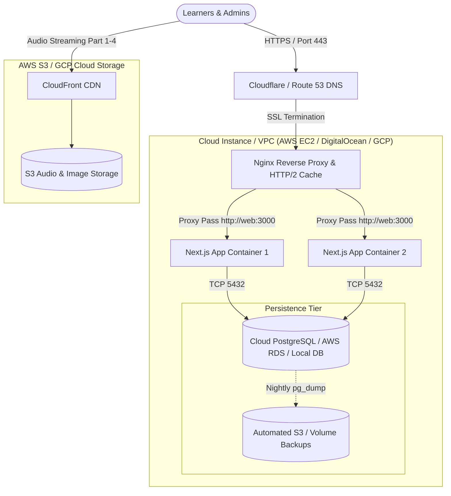

# Guide 2: Deploying TOEIC PRO to Cloud Infrastructure (AWS / GCP / VPS / Docker)

This guide covers deploying the **TOEIC PRO Portal** into cloud infrastructure using containerization (**Docker**, **Docker Compose**, **AWS ECS / EC2**, **GCP Cloud Run**, or **DigitalOcean**).

---

## 1. Cloud Architecture Overview

When deploying to dedicated cloud environments, containerizing the application using Next.js 14's **standalone output** reduces container images from ~1.2 GB to under **150 MB**, ensuring rapid restarts, low memory footprint, and high density.



---

## 2. Cloud Deployment Strategies: Choose Your Platform

| Deployment Model | Best Platform Options | Recommended For | Estimated Cost |
| :--- | :--- | :--- | :--- |
| **PaaS / Serverless Containers** | **Render**, **Railway**, **GCP Cloud Run** | Zero infra maintenance, automated Git deploys, simple scaling. | $7 - $25 / month |
| **Cloud VPS + Docker Compose** | **DigitalOcean Droplet**, **Hetzner Cloud**, **AWS EC2** | Complete control, cost efficiency, single-server setup for 5,000+ daily users. | $6 - $20 / month |
| **Enterprise Managed Cluster** | **AWS ECS (Fargate)** or **GKE (Kubernetes)** | High availability, multi-zone failover, horizontal auto-scaling. | $50 - $200+ / month |

---

## 3. Option A: Production VPS Deployment (AWS EC2 / DigitalOcean / Ubuntu)

This is the most cost-effective and common setup for self-hosting production web applications.

### 3.1 Provision Server Prerequisites
- **OS**: Ubuntu 22.04 LTS or 24.04 LTS
- **Specs**: Minimum 2 vCPU, 2 GB RAM (4 GB RAM recommended for smooth Docker builds)
- **Ports to open in Security Group / Firewall**:
  - `22` (SSH)
  - `80` (HTTP for Let's Encrypt verification)
  - `443` (HTTPS secure traffic)

### 3.2 Install Docker & Docker Compose
Connect to your server via SSH:
```bash
ssh ubuntu@your-server-ip

# Update packages and install Docker engine
sudo apt-get update
sudo apt-get install -y ca-certificates curl gnupg lsb-release

# Add Docker GPG key & repo
sudo mkdir -p /etc/apt/keyrings
curl -fsSL https://download.docker.com/linux/ubuntu/gpg | sudo gpg --dearmor -o /etc/apt/keyrings/docker.gpg
echo \
  "deb [arch=$(dpkg --print-architecture) signed-by=/etc/apt/keyrings/docker.gpg] https://download.docker.com/linux/ubuntu \
  $(lsb_release -cs) stable" | sudo tee /etc/apt/sources.list.d/docker.list > /dev/null

sudo apt-get update
sudo apt-get install -y docker-ce docker-ce-cli containerd.io docker-compose-plugin

# Enable Docker without sudo
sudo usermod -aG docker $USER
newgrp docker
```

### 3.3 Clone Repository & Setup Production Secrets
```bash
git clone https://github.com/your-org/toeic_training_portal.git /var/www/toeic_pro
cd /var/www/toeic_pro

# Create production .env
cat << 'EOF' > .env
NODE_ENV=production
PORT=3000
POSTGRES_USER=toeic_prod_user
POSTGRES_PASSWORD=UltraSecurePassword2026!
POSTGRES_DB=toeic_pro_prod
DATABASE_URL=postgresql://toeic_prod_user:UltraSecurePassword2026!@db:5432/toeic_pro_prod?schema=public
JWT_SECRET=super-secure-jwt-key-minimum-32-chars-toeic-pro-2026
JWT_REFRESH_SECRET=super-secure-refresh-key-minimum-32-chars-toeic-pro-2026
NEXT_PUBLIC_APP_URL=https://toeicpro.yourdomain.com
EOF
```

### 3.4 Configure Domain & SSL Certificate (Let's Encrypt)
1. Point your domain's DNS A Record to `your-server-ip`.
2. Install Certbot on the host or use the Certbot container:
   ```bash
   sudo apt-get install -y certbot
   sudo certbot certonly --standalone -d toeicpro.yourdomain.com
   ```
3. Update `/var/www/toeic_pro/nginx/nginx.conf` to enable SSL listening on port 443 with your certificate paths:
   ```nginx
   server {
       listen 80;
       server_name toeicpro.yourdomain.com;
       return 301 https://$host$request_uri;
   }

   server {
       listen 443 ssl http2;
       server_name toeicpro.yourdomain.com;

       ssl_certificate /etc/letsencrypt/live/toeicpro.yourdomain.com/fullchain.pem;
       ssl_certificate_key /etc/letsencrypt/live/toeicpro.yourdomain.com/privkey.pem;
       ssl_protocols TLSv1.2 TLSv1.3;
       ssl_ciphers HIGH:!aNULL:!MD5;

       # ... remaining proxy locations ...
   }
   ```

### 3.5 Launch Production Stack
```bash
# Build images and run containers in background
docker compose -f docker-compose.prod.yml up -d --build

# Run initial seed data (create Admin & student accounts, questions, daily quests)
docker compose -f docker-compose.prod.yml exec web node prisma/seed.js

# Verify status of all services
docker compose -f docker-compose.prod.yml ps
```

---

## 4. Option B: Cloud Containers (Google Cloud Run / AWS ECS / Render)

If you prefer managed containers without maintaining Linux servers:

### 4.1 Build & Push Multi-Architecture Image to Registry
```bash
# Authenticate to AWS ECR or Docker Hub
docker login

# Build image with production tag
docker build -t yourusername/toeic-pro-portal:v10.0.0 .

# Push image
docker push yourusername/toeic-pro-portal:v10.0.0
```

### 4.2 Deploy to Google Cloud Run
1. In Google Cloud Console, navigate to **Cloud Run** > **Create Service**.
2. Select your container image (`yourusername/toeic-pro-portal:v10.0.0`).
3. Set CPU and Memory:
   - **CPU**: 1 vCPU (or 2 vCPU for high concurrent scoring)
   - **Memory**: 1 GiB (or 2 GiB)
   - **Min instances**: 1 (to eliminate cold starts for learners)
   - **Max instances**: 10 (auto-scales with traffic)
4. Under **Variables & Secrets**, add:
   - `DATABASE_URL` (Points to Google Cloud SQL Postgres or Neon)
   - `JWT_SECRET` & `JWT_REFRESH_SECRET`
   - `NEXT_PUBLIC_APP_URL`
5. Click **Deploy**. Cloud Run automatically provides HTTPS and global load balancing.

---

## 5. Automated Database Backups & Maintenance

Never run production without automated backups. Create a daily backup cron job:

```bash
# Create backup directory
sudo mkdir -p /var/backups/toeic_db

# Create backup script: /usr/local/bin/backup-toeic-db.sh
cat << 'EOF' | sudo tee /usr/local/bin/backup-toeic-db.sh
#!/bin/bash
DATE=$(date +%Y%m%d_%H%M%S)
BACKUP_FILE="/var/backups/toeic_db/toeic_pro_${DATE}.sql.gz"

docker exec toeic_prod_db pg_dump -U toeic_prod_user toeic_pro_prod | gzip > $BACKUP_FILE

# Keep only last 14 days of backups
find /var/backups/toeic_db -type f -name "*.sql.gz" -mtime +14 -delete

echo "Backup completed: $BACKUP_FILE"
EOF

sudo chmod +x /usr/local/bin/backup-toeic-db.sh

# Schedule nightly at 03:00 AM UTC
(crontab -l 2>/dev/null; echo "0 3 * * * /usr/local/bin/backup-toeic-db.sh >> /var/log/toeic_backup.log 2>&1") | crontab -
```

---

## 6. Continuous Deployment (CI/CD) with GitHub Actions

Automate deployments on every push to `main` by adding `.github/workflows/deploy.yml`:

```yaml
name: Deploy Production to Cloud

on:
  push:
    branches: [ main ]

jobs:
  deploy:
    runs-on: ubuntu-latest
    steps:
      - name: Checkout Code
        uses: actions/checkout@v4

      - name: Deploy via SSH to VPS
        uses: appleboy/ssh-action@v1.0.3
        with:
          host: ${{ secrets.SERVER_HOST }}
          username: ${{ secrets.SERVER_USER }}
          key: ${{ secrets.SSH_PRIVATE_KEY }}
          script: |
            cd /var/www/toeic_pro
            git pull origin main
            docker compose -f docker-compose.prod.yml build web
            docker compose -f docker-compose.prod.yml up -d --no-deps web
            docker compose -f docker-compose.prod.yml exec -T web npx prisma db push
            echo "Deployment successful!"
```

---

## 7. Operational Troubleshooting Commands

| Task | Command |
| :--- | :--- |
| **View Web App Logs** | `docker compose -f docker-compose.prod.yml logs -f --tail=100 web` |
| **View Nginx Access Logs** | `docker compose -f docker-compose.prod.yml logs -f nginx` |
| **Open Postgres Console** | `docker compose -f docker-compose.prod.yml exec db psql -U toeic_prod_user -d toeic_pro_prod` |
| **Restart Web Container** | `docker compose -f docker-compose.prod.yml restart web` |
| **Execute Prisma DB Studio** | `docker compose -f docker-compose.prod.yml exec web npx prisma studio --port 5555 --hostname 0.0.0.0` |
